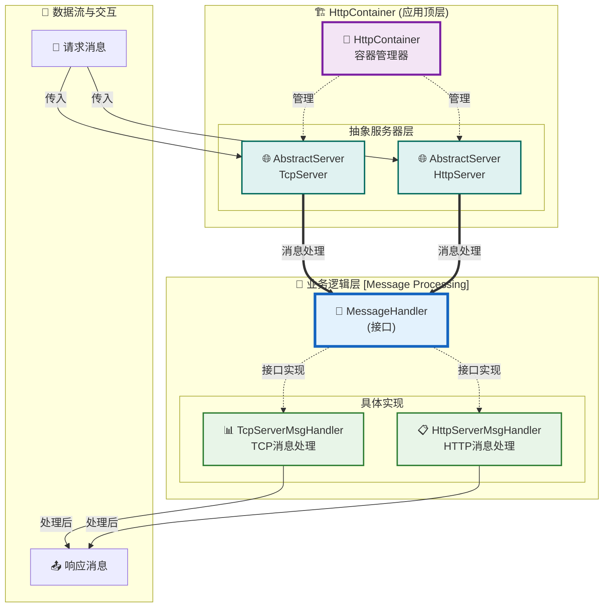

# MiniEvent 架构图表

## HttpContainer 应用架构

## 架构说明

### 🎯 核心设计理念
- **分层架构**: 清晰的应用层、业务层分离
- **接口抽象**: MessageHandler提供统一的消息处理接口
- **多态实现**: 支持不同协议的消息处理器
- **容器管理**: HttpContainer统一管理服务器实例

### 📊 组件职责

#### 应用顶层 (HttpContainer)
- **HttpContainer**: 容器管理器，负责协调各个服务器实例
- **AbstractServer**: 抽象服务器基类，提供TCP和HTTP服务器的通用功能

#### 业务逻辑层 (Message Processing)
- **MessageHandler**: 消息处理接口，定义标准的消息处理契约
- **TcpServerMsgHandler**: TCP协议消息处理的具体实现
- **HttpServerMsgHandler**: HTTP协议消息处理的具体实现

### 🔄 数据流向
1. **请求接收**: 外部请求通过AbstractServer接收
2. **消息处理**: 通过MessageHandler接口进行统一处理
3. **具体实现**: 根据协议类型调用相应的处理器
4. **响应返回**: 处理结果通过相同路径返回

### 🎨 设计优势
- **可扩展性**: 新增协议只需实现MessageHandler接口
- **可维护性**: 清晰的职责分离和接口抽象
- **可测试性**: 接口抽象便于单元测试和模拟测试
- **灵活性**: 支持运行时切换不同的消息处理实现
